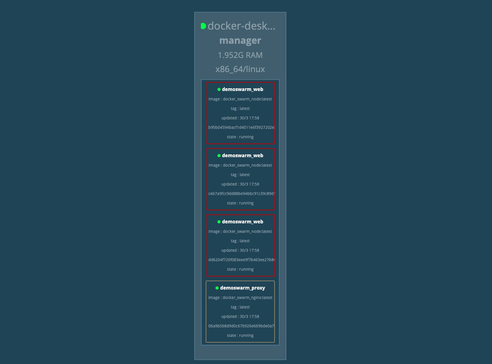

# The Basics of Docker Swarm

Simple container orchestration using Docker Swarm. Please see the `package.json` for more information about the commands and `docker-compose.yml` for the stack setup.

#### Install

`npm install`

#### Build the node.app image

`npm run build:node`

#### Build the `nginx` image which will act as a load balancer for our node.js apps

`npm run build:nginx`

#### Run docker engine in `swarm` mode

`npm run init-swarm`

#### Deploy the swarm stack

`npm run deploy`

#### Run the visualizer, to see the deployed stack (manager and workers)

`npm run visualizer`

#### Remove the deployed stack

`npm run stack:kill`

#### License

Release under MIT
